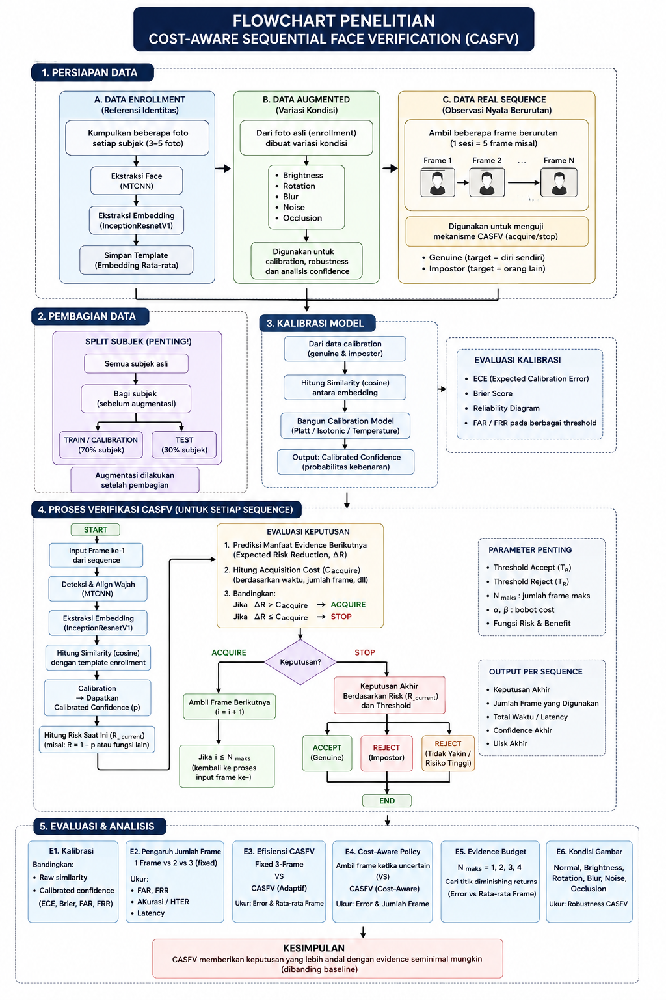
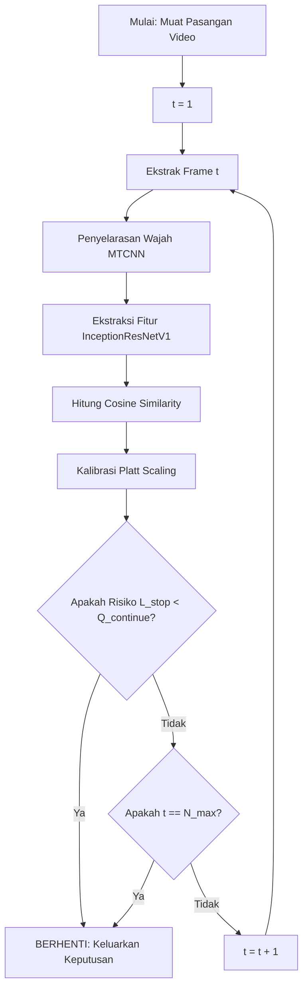
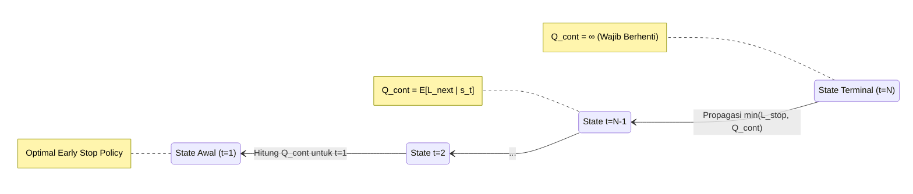

# Evidence-Driven Adaptive Verification (EDAV)

Repositori ini berisi **implementasi inti** dari kerangka kerja *Evidence-Driven Adaptive Verification* (EDAV). EDAV adalah sebuah protokol pengambilan keputusan sekuensial yang dirancang untuk secara dinamis mengoptimalkan kedalaman komputasi (jumlah *frame* yang diproses) pada sistem verifikasi wajah, berdasarkan tingkat keyakinan (*confidence*) skor kemiripan secara *real-time*.

## Arsitektur Sistem

Diagram di bawah ini mengilustrasikan alur kerja dari protokol EDAV, mulai dari ekstraksi bingkai (*frame*) mentah hingga keputusan pemberhentian awal secara dinamis menggunakan *backward induction*:



### 1. Pemrosesan Bingkai Sekuensial (Simulasi Nyata)

Untuk memvisualisasikan secara lebih jelas bagaimana algoritma ini mengambil keputusan, perhatikan tabel eksekusi sekuensial di bawah ini. Pada setiap penambahan *frame* (langkah $t$), sistem akan mengakumulasi bukti kemiripan wajah hingga tingkat keyakinannya melampaui batas aman (95%).

| Langkah (t) | Bingkai Target | Bingkai Probe | Akumulasi Bukti | Keputusan Sistem |
| :---: | :---: | :---: | :--- | :--- |
| **t = 1** |  |  | 🪫 **Keyakinan: 65%** <br>*(Batas Aman: 95%)* | ❌ **Bukti Kurang** <br>*(Sistem menolak untuk mengambil keputusan, lanjut ekstrak frame berikutnya)* |
| **t = 2** |  |  | 🔋 **Keyakinan: 82%** <br>*(Batas Aman: 95%)* | ⚠️ **Hampir Yakin** <br>*(Risiko salah tebak masih ada, lanjut ekstrak frame berikutnya)* |
| **t = 3** |  |  | 💯 **Keyakinan: 98%** <br>*(Melampaui 95%)* | ✅ **BUKTI CUKUP!** <br>*(Verifikasi dihentikan lebih awal! Wajah diyakini SAMA)* |

*Tabel di atas mendemonstrasikan kekuatan utama EDAV pada skenario **Positif (Match)**: sistem tidak membuang-buang komputasi dengan memproses seluruh isi video, melainkan berhenti secara dinamis (misal pada frame ke-3) tepat ketika bukti sudah dianggap sahih.*

### Mekanisme Penolakan (Impostor / Mismatch)

Lalu, bagaimana jika sistem menghadapi wajah yang berbeda (Impostor)? EDAV memiliki mekanisme pencegahan komputasi berlebih:
- Jika tingkat keyakinan terus-menerus meragukan (misalnya stagnan di bawah 50%) dan tidak mampu menembus batas aman 95% hingga batas jumlah *frame* maksimal ($t = N_{max}$) tercapai, maka sistem akan berhenti berburu bukti dan seketika mengeluarkan keputusan **MENOLAK (Reject)**.
- **Alasan Penolakan:** Kurangnya akumulasi bukti kemiripan yang solid dalam jendela waktu (jumlah *frame*) yang telah diizinkan. Sistem menganggap risiko menyimpulkan bahwa wajah tersebut sama terlalu tinggi, sehingga menolak akses demi keamanan.

### 2. Alur Verifikasi Sekuensial (Fase Runtime)

Bagan alir (*flowchart*) ini memvisualisasikan proses keputusan dinamis pada saat sistem berjalan (*runtime*). Berbeda dengan metode dasar yang menggunakan jumlah *frame* tetap (*fixed-depth baseline*), EDAV mengevaluasi bukti secara bertahap dan berhenti tepat pada saat tingkat keyakinan telah melampaui batas risiko yang dapat diterima.



### 3. Kebijakan Backward Induction (Fase Pelatihan)

Sebelum sistem dijalankan, kebijakan keputusan (Tabel Risiko $Q$) dibangun dari arah belakang, dimulai dari kedalaman maksimum ($t=N$). Diagram status berikut menunjukkan bagaimana ekspektasi kerugian di masa depan ditarik mundur untuk menciptakan kebijakan pemberhentian awal yang paling optimal.



## Struktur Inti Repositori

Repositori ini telah disederhanakan hingga hanya menyisakan komponen-komponen inti agar fokus murni pada algoritma:

- **`experiments/edav_main.py`**: Skrip utama dan satu-satunya untuk eksekusi. Skrip ini menjalankan protokol EDAV secara utuh (evaluasi 10-fold CV tanpa kebocoran data, pelacakan *state*, dan pengambilan keputusan sekuensial).
- **`src/`**: Modul sumber inti yang menggerakkan algoritma:
  - `sampling/`: Pemilihan *frame* secara deterministik.
  - `detection/`: Pendeteksian kotak wajah dan penyelarasan (*alignment*) berbasis MTCNN.
  - `embedding/`: Ekstraksi fitur menggunakan model *pre-trained* InceptionResNetV1.
  - `similarity/`: Perhitungan matriks *pairwise cosine similarity*.
  - `calibration/`: Pemetaan nilai *similarity* menjadi nilai tingkat keyakinan yang akurat (*Platt Scaling*).
- **`ytf_loader.py` & `read_mat_file.py`**: Modul pembantu untuk mengurai dan membaca struktur dataset YouTube Faces (YTF).

## Kebutuhan Sistem (Dependencies)

- `torch`, `torchvision`
- `scikit-learn`
- `numpy`, `pandas`, `scipy`

## Persiapan Dataset

Dataset mentah **tidak disertakan** di dalam repositori ini karena ukuran filenya yang sangat besar. Untuk menjalankan implementasi inti ini di komputer Anda, Anda harus mengunduh dataset YouTube Faces (YTF) dan meletakkannya di dalam direktori `dataset ytf/` pada folder utama (*root*) proyek.

Arsip yang dibutuhkan:
- `frame_images_DB.tar.gz`
- `headpose_DB.tar.gz`
- `meta_data.tar.gz`

## Menjalankan Protokol

Eksekusi protokol utama EDAV melalui terminal/Command Prompt:

```bash
python experiments/edav_main.py
```
*(Pastikan seluruh kebutuhan sistem telah diinstal dan dataset telah diekstrak dengan benar sebelum mengeksekusi perintah di atas).*
