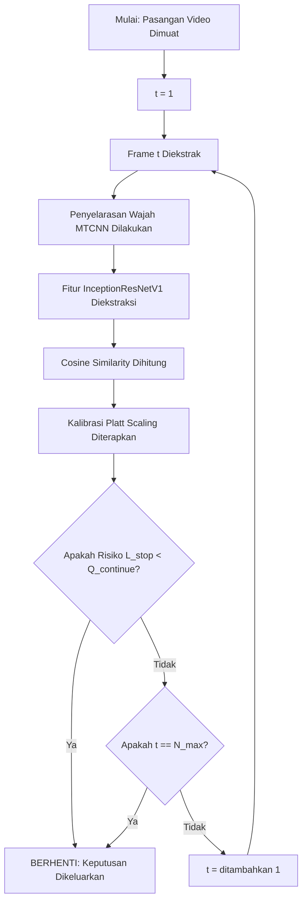
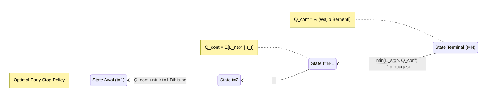

# Evidence-Driven Adaptive Verification (EDAV)

Implementasi inti dari kerangka kerja *Evidence-Driven Adaptive Verification* (EDAV) disertakan di dalam repositori ini. EDAV merupakan sebuah protokol pengambilan keputusan sekuensial yang dirancang agar kedalaman komputasi (jumlah *frame* yang diproses) pada sistem verifikasi wajah dapat dioptimalkan secara dinamis, berdasarkan pada tingkat keyakinan (*confidence*) dari skor kemiripan yang dihitung secara *real-time*.

## Arsitektur Sistem

Alur kerja dari protokol EDAV, mulai dari ekstraksi bingkai (*frame*) mentah hingga keputusan pemberhentian awal secara dinamis menggunakan *backward induction*, diilustrasikan oleh diagram di bawah ini:


### 1. Pemrosesan Bingkai Sekuensial (Simulasi Nyata)

Agar proses pengambilan keputusan oleh algoritma ini dapat divisualisasikan dengan lebih jelas, tabel eksekusi sekuensial di bawah ini disertakan sebagai rujukan. Pada setiap penambahan *frame* (langkah $t$), bukti kemiripan wajah akan diakumulasi oleh sistem hingga batas aman (95%) berhasil dilampaui oleh tingkat keyakinannya.

| Langkah (t) | Bingkai Target | Bingkai Probe | Akumulasi Bukti | Keputusan Sistem |
| :---: | :---: | :---: | :--- | :--- |
| **t = 1** |  |  | 🪫 **Keyakinan: 65%** <br>*(Batas Aman: 95%)* | ❌ **Bukti Kurang** <br>*(Keputusan ditolak untuk diambil, ekstraksi frame berikutnya dilanjutkan)* |
| **t = 2** |  |  | 🔋 **Keyakinan: 82%** <br>*(Batas Aman: 95%)* | ⚠️ **Hampir Yakin** <br>*(Risiko salah tebak dinilai masih ada, ekstraksi frame berikutnya dilanjutkan)* |
| **t = 3** |  |  | 💯 **Keyakinan: 98%** <br>*(Melampaui 95%)* | ✅ **BUKTI CUKUP!** <br>*(Verifikasi dihentikan lebih awal! Bukti diyakini sudah valid)* |

*Kekuatan utama EDAV didemonstrasikan oleh tabel di atas pada skenario **Positif (Match)**: komputasi tidak dibuang secara sia-sia untuk memproses seluruh isi video, melainkan eksekusi dihentikan secara dinamis (misal pada frame ke-3) tepat pada saat bukti telah dianggap sahih oleh sistem.*

### Mekanisme Penolakan (Impostor / Mismatch)

Lalu, bagaimana jika wajah yang berbeda (Impostor) dihadapi oleh sistem? Mekanisme pencegahan komputasi berlebih telah disematkan pada EDAV:
- Jika tingkat keyakinan terus-menerus terpantau meragukan (misalnya stagnan di bawah 50%) dan batas aman 95% tidak mampu ditembus hingga batas jumlah *frame* maksimal ($t = N_{max}$) tercapai, maka perburuan bukti akan dihentikan dan keputusan **MENOLAK (Reject)** akan seketika dikeluarkan oleh sistem.
- **Alasan Penolakan:** Kurangnya akumulasi bukti kemiripan yang solid di dalam jendela waktu (jumlah *frame*) yang telah diizinkan. Risiko dari penyimpulan bahwa wajah tersebut sama dianggap terlalu tinggi oleh sistem, sehingga akses ditolak demi alasan keamanan.

### 2. Alur Verifikasi Sekuensial (Fase Runtime)

Proses keputusan dinamis pada saat sistem dijalankan (*runtime*) divisualisasikan melalui bagan alir (*flowchart*) berikut. Berbeda dengan metode dasar yang menggunakan jumlah *frame* tetap (*fixed-depth baseline*), bukti dievaluasi secara bertahap oleh EDAV, dan pemrosesan akan dihentikan secara presisi pada saat batas risiko yang dapat diterima telah dilampaui oleh tingkat keyakinan.



### 3. Kebijakan Backward Induction (Fase Pelatihan)

Sebelum sistem dijalankan, kebijakan keputusan (Tabel Risiko $Q$) dibangun dari arah belakang, yakni dimulai dari kedalaman maksimum ($t=N$). Diagram status berikut menunjukkan bagaimana ekspektasi kerugian di masa depan ditarik mundur agar kebijakan pemberhentian awal yang paling optimal dapat diciptakan.



## Struktur Inti Repositori

Repositori ini telah disederhanakan hingga hanya menyisakan komponen-komponen inti agar algoritma dapat dijadikan fokus utama:

- **`experiments/edav_main.py`**: Skrip utama dan satu-satunya untuk eksekusi. Protokol EDAV secara utuh dijalankan oleh skrip ini (evaluasi 10-fold CV tanpa kebocoran data, pelacakan *state*, dan pengambilan keputusan sekuensial).
- **`src/`**: Modul sumber inti yang digunakan untuk menggerakkan algoritma:
  - `sampling/`: *Frame* dipilih secara deterministik.
  - `detection/`: Kotak wajah dideteksi dan diselaraskan (*alignment*) berbasis MTCNN.
  - `embedding/`: Fitur diekstraksi menggunakan model *pre-trained* InceptionResNetV1.
  - `similarity/`: Matriks *pairwise cosine similarity* dihitung.
  - `calibration/`: Nilai *similarity* dipetakan menjadi nilai tingkat keyakinan yang akurat (*Platt Scaling*).
- **`ytf_loader.py` & `read_mat_file.py`**: Modul pembantu yang disediakan agar struktur dataset YouTube Faces (YTF) dapat diurai dan dibaca.

## Kebutuhan Sistem (Dependencies)

- `torch`, `torchvision`
- `scikit-learn`
- `numpy`, `pandas`, `scipy`

## Persiapan Dataset

Dataset mentah **tidak disertakan** di dalam repositori ini dikarenakan oleh ukuran filenya yang terlampau besar. Agar implementasi inti ini dapat dijalankan di komputer lokal Anda, dataset YouTube Faces (YTF) diwajibkan untuk diunduh dan diletakkan di dalam direktori `dataset ytf/` pada folder utama (*root*) proyek.

Arsip yang dibutuhkan untuk diekstrak:
- `frame_images_DB.tar.gz`
- `headpose_DB.tar.gz`
- `meta_data.tar.gz`

## Menjalankan Protokol

Protokol utama EDAV dapat dieksekusi melalui terminal/Command Prompt menggunakan perintah berikut:

```bash
python experiments/edav_main.py
```
*(Seluruh kebutuhan sistem diwajibkan untuk diinstal dan dataset dipastikan telah diekstrak dengan benar sebelum perintah di atas dieksekusi).*
